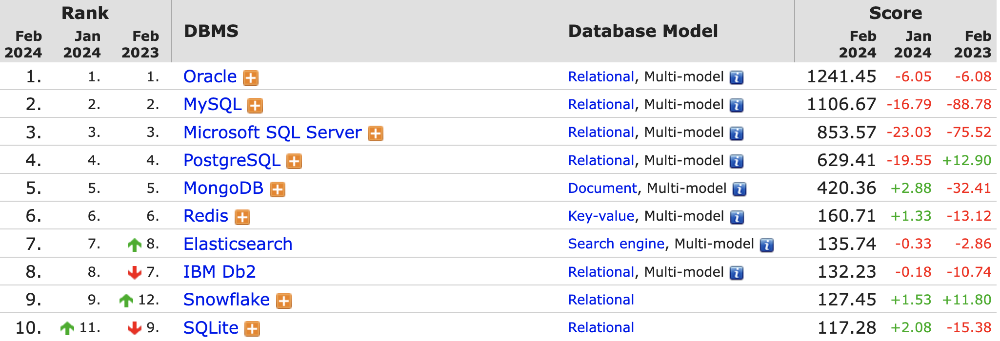
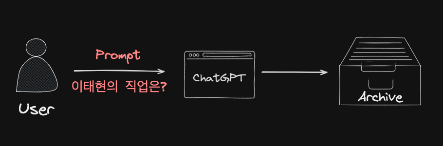
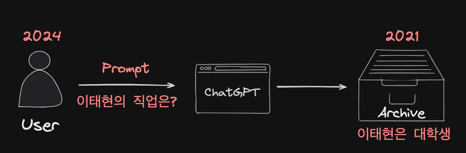
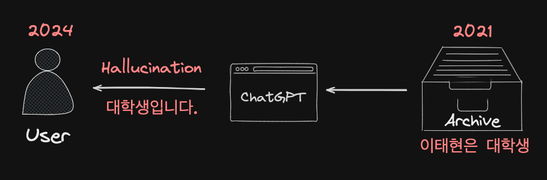
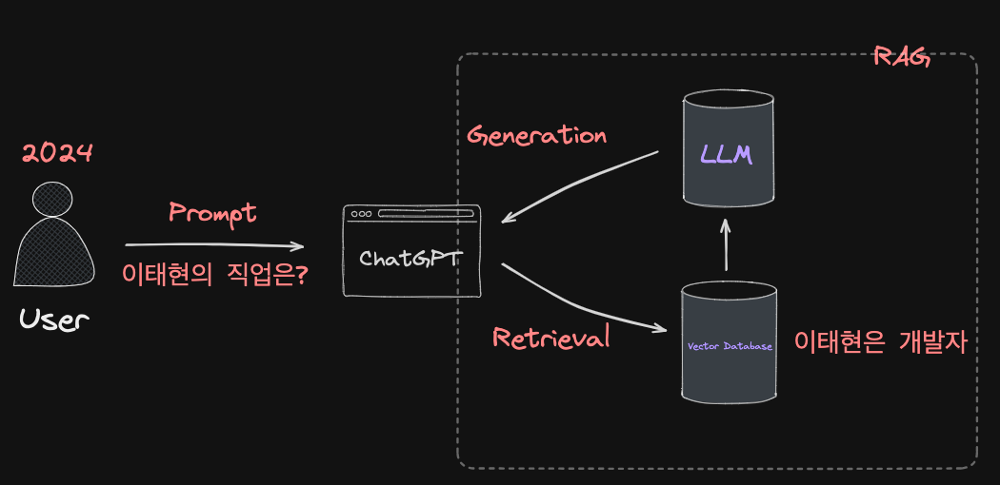

# 01. 소개

---

## 1.1 MySQL 소개

---

## MySQL 라이선스 정책

1. 엔터프라이즈 에디션
2. 커뮤니티 에디션

---

## 에디션에 따른 차이

MySQL 5.5 GA(General Available) 버전부터는 엔터프라이즈 에디션의 소스코드 미공개

---

## 1.2 왜 MySQL인가?

---

## MySQL의 경쟁력: **비용**

---

## DBMS 선택 방법

*"자기가 가장 잘 활용할 수 있는 DBMS가 가장 좋은 DBMS입니다."*

---

## DBMS 선택에서 고려해야 할 우선순위

1. 안정성
2. 성능과 기능
3. 커뮤니티나 인지도

---

## 안정성이 최우선 고려사항인 이유

### : **성능이나 기능은 돈이나 노력으로 해결**되지만 안정성은 그렇지 않기 때문

---

## [DBMS 서버 랭킹](https://db-engines.com/en/ranking)

---

> 2024년 02월 10일 토요일 기준

---

## 함께 이야기해보면 좋을 주제들

---

## 1. 벡터 데이터베이스(Vector Database)

---

### LLM(Large Language model)의 부흥

---

---

---

---

### 할루시네이션(Hallucination) 해결 방법

#### : RAG(Retrieval-Augmented Generatrion)

---

---

## 2. MySQL vs PostgreSQL

---

### MVCC(Multi-Version Concurrency Control)

#### : **04. 아키텍처** 부분에서 더 이야기 나누면 좋은 주제