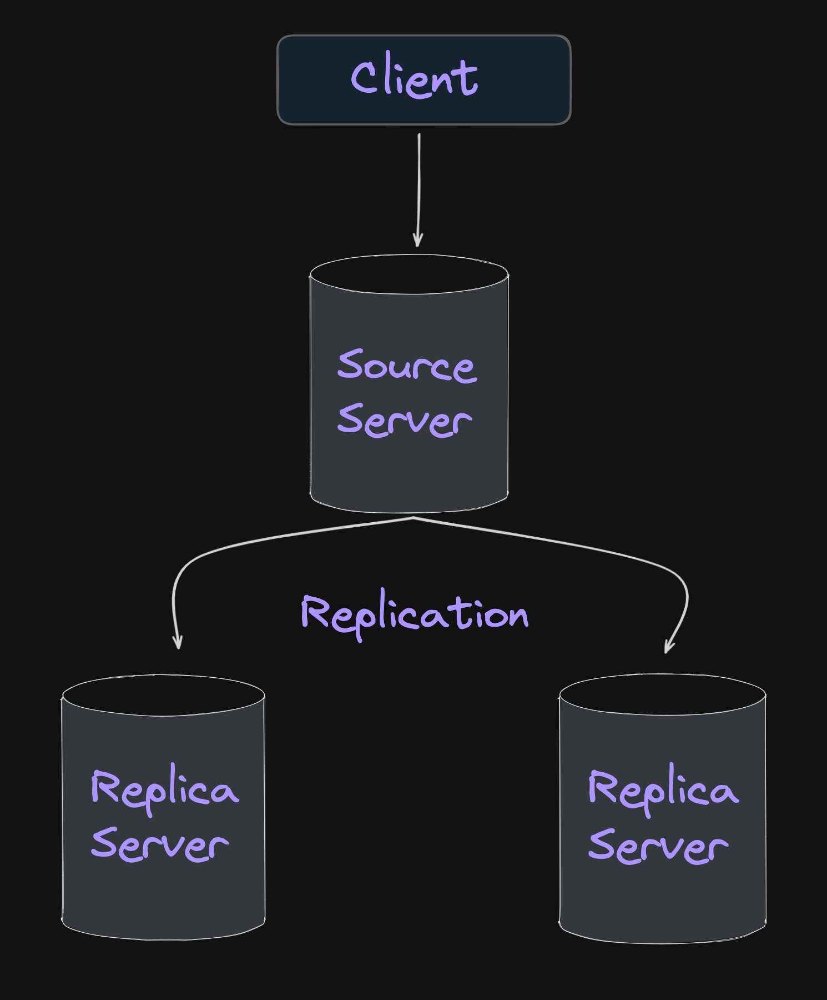
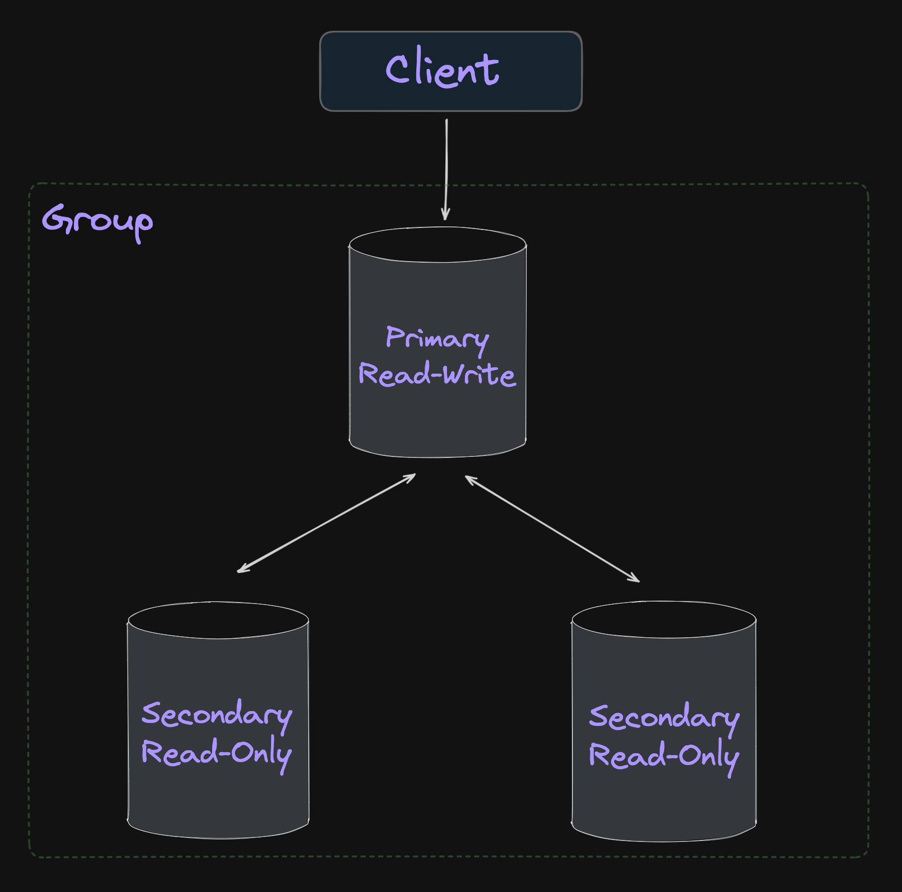
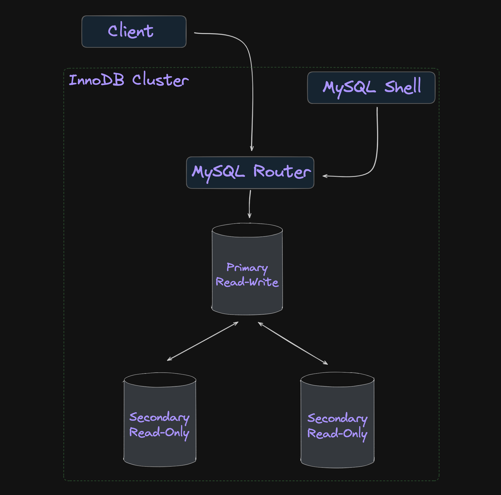
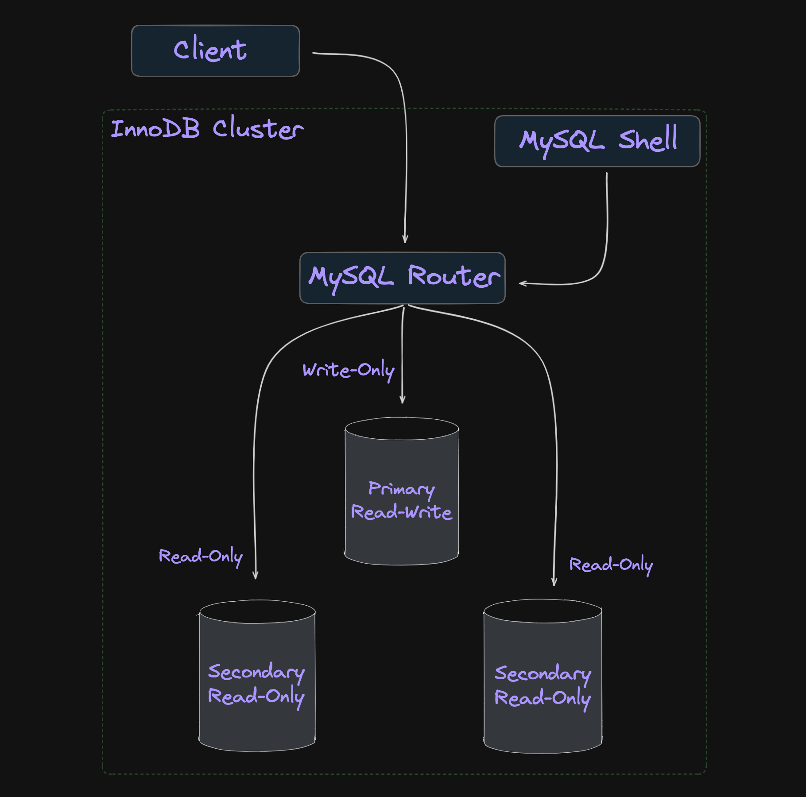
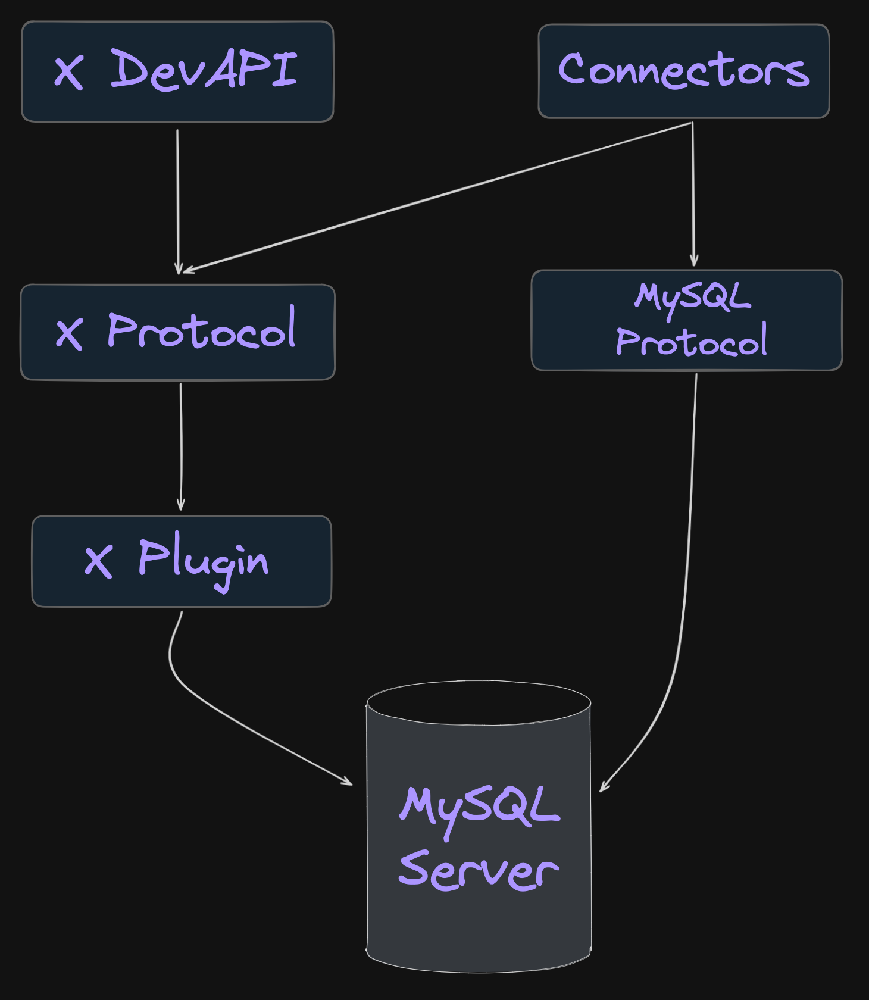

# 02. 설치와 설정

---

## MySQL Router

### : **프록시(Proxy)** 역할을 해주는 미들웨어로 MySQL 프록시라는 별칭 존재

---

### MySQL 프록시의 필요성

: MySQL에는 레플리케이션(Replication)을 통해 부하 분산이 가능하며, [HAProxy](https://www.haproxy.org/) 또는 더 단순하게는 [ProxySQL](https://proxysql.com/)을 사용하여 MySQL 서버에 대한 읽기 요청과 쓰기 요청 분리(Read/Write Split)

---

### MySQL 프록시의 필요성

#### **고가용성(High Availiability, HA)** 

---

### MySQL의 고가용성(High Availiability, HA)

: MySQL 8.0 미만 버전에서는 장애에 따른 페일오버(Failover)를 사용자가 직접 구축했어야 했기 때문에 외부 솔루션을 사용했으나, InnoDB 클러스터 등장으로 이를 MySQL 내에 자체 구현된 솔루션으로 사용하여 쉽게 고가용성 확보

---

### 레플리케이션(Replication)

: 원본 데이터를 가진 소스 서버(Source Server)와 원본 데이터의 복제된 데이터를 가지는 레플리카 서버(Replica Server)로 구축해서 장애가 발생했을 때 고가용성 확보

---



---

### 그룹 레플리케이션(Group Replication)

: InnoDB 저장소 엔진(Storage Engine)을 사용하여 읽기 및 쓰기가 가능한 프라이머리 서버(Primary Server)와 읽기만 가능한 세컨더리 서버(Secondary Server)를 하나의 그룹으로 관리하고 MySQL 라우터 및 MySQL 쉘(Shell)을 활용하여 장애에 대한 자동화된 페일오버(Failover) 구축

---



---

### MySQL InnoDB 클러스터(Cluster)

: 읽기 및 쓰기가 가능한 프라이머리 서버(Primary Server)와 읽기만 가능한 세컨더리 서버(Secondary Server)로 구성되며, InnoDB 저장소 엔진(Storage Engine)만 사용 가능하기 때문에 InnoDB 클러스터라 명명

---



---

### MySQL InnoDB 클러스터에서의 읽기-쓰기 분산(Read-Write Split)

: MySQL 라우터 8.2 버전 미만에서는 읽기 요청을 세컨더리 서버(Secondary Server)에, 쓰기 요청을 프라이머리 노드(Primary Server)에 직접 연결하지 못했기 때문에 HAPRoxy 또는 ProxySQL 등의 외부 프록시 미들웨어 사용

---



---

## X Protocol

: MySQL 서버와 통신하기 위한 인터페이스 중 하나인 X Plugin을 통해 기존과 다른 방식으로 통신할 수 있게 도와주는 프로토콜로 대표적인 예시로는 MySQL을 일종의 문서 저장소(Document Store)로 사용할 때 이용

---



---

### X DevAPI

: X DevAPI는 X Protocol을 통해 클라이언트가 MySQL 서버와 통신할 때 JavaScript 또는 Python 같은 최신 프로그래밍 언어(Modern Programming Language)을 사용할 수 있게 제공하는 인터페이스

---

## 클린 셧다운(Clean Shutdown)

: MySQL 서버에서는 실제 트랜잭션이 정상적으로 커밋(Commit)되어도 데이터 파일에 변경된 내용이 기록되지 않고 로그 파일(Redo Log)에만 기록될 수 있는데 `innodb_fast_shutdown` 시스템 변수 옵션 값을 변경하여 모든 커밋된 데이터를 데이터 파일에 적용하고 종료하는 클린 셧다운 구축 가능

---

## MySQL 서버 접속 호스트

1. 로컬호스트(Localhost) 명시
2. 루프백(Loopback) IP 주소 명시

---

### 로컬호스트(Localhost) 명시

: `localhost` 지정은 **소켓 파일**을 통해 MySQL 서버에 접근하는 걸 의미하기 때문에 **Unix Domain Socket**을 이용하는 방식으로 **프로세스 간 통신(Inter Process Communication, IPC)** 에 해당

---

### 루프백(Loopback) IP 주소 명시

: `127.0.0.1` 지정은 본인 서버를 가리키는 **루프백(Loopback) IP 주소**지만 **TCP/IP 통신**에 해당

---

## 배너 그래빙(Banner Grabbing)

: 배너(Banner)는 원격지에서 프로그램에 접근할 때 뜨는 안내문을 의미하며, 배너 그래빙(Banner Grabbing)은 단어 그대로 안내문 수집을 의미하며, 포트 스캔과 배너 그래빙을 통해서 실행 중인 프로그램 정보 수집 가능

```Bash
> telnet ip_address 3306

HHost 'ip_address' is not allowed to connect to this MySQL serverConnection closed by foreign host.
```

---

## MySQL 서버 업그레이드

1. 인플레이스 업그레이드(In-Place Upgrade)
2. 논리적 업그레이드(Logical Upgrade)

---

### 인플레이스 업그레이드(In-Place Upgrade)

: MySQL 서버의 데이터 파일을 그대로 둔 상태에서 업그레이드하는 방법으로 여러 가지 제약 사항이 존재하지만 시간 단축의 효용성 존재

---

### 논리적 업그레이드(Logical Upgrade)

: `mysqldump` 도구 등을 이용해 MySQL 서버의 데이터를 SQL 문장이나 텍스트 파일로 덤프한 후 해당 데이터를 업그레이드된 버전의 MySQL 서버에 적재하는 방법으로 제약 사항이 거의 없지만 시간이 매우 많이 소요되는 단점 존재

---

## MySQL 시스템 변수

1. 글로벌 변수
2. 세션 변수

---

### 시스템 변수의 다섯 가지 속성

1. Cmd-Line
2. Option File
3. System Var
4. Var Scope
5. Dynamic

---

### Cmd-Line

: MySQL 서버의 명령행 인자로 설정될 수 있는지 여부

---

### Option File

: MySQL의 설정 파일인 `my.cnf` 또는 `my.ini` 파일로 제어할 수 있는지 여부

---

### System Var

: 시스템 변수 여부

---

### Var Scope

: 시스템 변수의 적용 범위

---

### Dynamic

: 시스템 변수의 종류

---

## 글로벌 변수와 세션 변수

### : **적용 범위**에 따라 구분

---

### 글로벌 변수(Global Variable)

: 하나의 MySQL 서버 인스턴스에서 전체적으로 영향을 미치는 시스템 변수를 의미 ex. InnoDB 버퍼 풀 크기( `innodb_buffer_pool_size` )

---

### 세션 변수(Session Variable)

: MySQL 클라이언트가 MySQL 서버에 접속할 때 기본으로 부여하는 옵션의 기본값 제어 ex. 주의 개수( `warning_count` )

---

## 정적 변수와 동적 변수

### : **MySQL 서버가 가동 중인 상태에서 변경 가능**한지 여부에 따라 구분

---

### 정적 변수

: 디스크에 저장되어 있는 설정 파일을 변경해서 적용해야 하는 변수 ex. 어드민 접속 IP 주소( `admin_addess` )

---

### 동적 변수

: 서버의 메모리에 있는 시스템 변수를 변경해서 적용할 수 있는 변수 ex. 자동 커밋( `autocommit` )

---

## 시스템 변수 관련 명령어

---

### 시스템 변수 확인

: `warning_count` 시스템 변수는 세션 변수이기 때문에 글로벌 변수 조회 때 빈 값 반환

```SQL
SHOW VARIABLES LIKE "warning%"; -- 세션 변수 조회
SHOW GLOBAL VARIABLES LIKE "warning%"; -- 글로벌 변수 조회
```

---

### 시스템 변수 설정

1. `SET GLOBAL variable_name;`
2. `SET PERSIST variable_name;`
3. `SET PERSIST_ONLY variable_name;` 

---

#### 동적 변수 설정

: 동적 변수의 경우 `SET` 명령어를 활용해 설정 가능하며, 글로벌 시스템 변수의 값을 변경해도 이미 존재하는 세션 변수는 유지

```SQL
SET join_buffer_size=2*1024*1024; -- 글로벌 시스템 변수로 인지
SET GLOBAL join_buffer_size=2*1024*1024;
```

---

#### 정적 변수 설정

: 정적 변수의 경우 `SET` 명령어와 함께 `PERSIST` 또는 `PERSIST_ONLY` 키워드를 활용하여 설정 가능하며, `mysqld-auto.cnf` 설정 파일에 JSON 포맷으로 저장

```SQL
SET PERSIST max_connections=1000; -- 실행 중인 서버에도 적용
SET PERSIST_ONLY max_connetions=1000; -- 설정 파일에만 적용
```

---

### 시스템 변수 삭제

: `RESET PERSIST` 명령어를 활용해 `mysqld-auto.cnf` 설정 파일에도 적용된 시스템 변수 설정 값 삭제

```SQL
RESET PERSIST max_connections;
```

---

## 함께 이야기해보면 좋을 주제들

---

### 1. `sql_mode` 시스템 변수

: `sql_mode` 시스템 변수는 글로벌 변수이면서 세션 변수이며, 동적 변수

---

#### `sql_mode` 시스템 변수의 `ONLY_FULL_GROUP_BY` 옵션

: 아래와 같은 `sale` 테이블 존재 가정, 월 별 가장 높은 수익과 아이디 값을 조회하기 위해서는 어떻게 해야할까?

```SQL
+------+---------+-------+
| id   | revenue | month |
+------+---------+-------+
| 1    | 8000    | Jan   |
| 2    | 7000    | Jan   |
| 3    | 6000    | Feb   |
+------+---------+-------+
```

---

#### 테이블 생성 및 데이터 입력

```SQL
CREATE TABLE sale (
    id INT NOT NULL AUTO_INCREMENT,
    revenue INT NOT NULL,
    month CHAR(3) NOT NULL,

    PRIMARY KEY (id)
);

INSERT INTO sale (revenue, month)
VALUES (8000, 'Jan'), (7000, 'Jan'), (6000, 'Feb');
```

---

##### 첫 번째 접근

: `GROUP BY` 구와 함께 `MAX` 집계 함수 사용

```SQL
SELECT
    id,
    MAX(revenue) AS the_highest_revenue,
    month
FROM sale
GROUP BY month;
```

---

##### 오류가 발생하는 경우

> ERROR 1055 (42000): Expression #1 of SELECT list is not in **GROUP BY clause and contains nonaggregated column** 'sale.id' which is **not functionally dependent** on columns in GROUP BY clause; this is **incompatible with sql_mode=only_full_group_by**

---

##### 오류가 발생하는 경우

1. 비집계 컬럼( `nonaggregated column` )
2. 함수적 종속성( `functionally dependent`)
3. SQL 모드( `sql_mode=only_full_group_by` )

---

##### 1. 비집계 컬럼( `nonaggregated column` )

: MySQL 서버는 `GROUP BY` 구를 통해 단 하나의 `month` 필드 값을 반환하고, `MAX` 집계 함수를 통해 단 하나의 `revenue` 필드 값을 반환하지만 여러 개의 `id` 필드 값 중 어떤 것을 반환해야 하는지 정해지지 않았기 때문에 오류 존재

```SQL
+------+---------+-------+
| id   | revenue | month |
+------+---------+-------+
| 1    | 8000    | Jan   |
| 2    | 8000    | Jan   |
+------+---------+-------+
```

---

##### 2. 함수정 종속성( `functionally dependent` )

: 월에 대해 언제 수입이 발생했는지 일자를 표시해주는 `day_of_month` 필드가 추가되었다고 가정

```SQL
+----+---------+-------+--------------+
| id | revenue | month | day_of_month |
+----+---------+-------+--------------+
|  1 |    8000 | Jan   | 0101         |
|  2 |    7000 | Jan   | 0102         |
|  3 |    6000 | Feb   | 0201         |
+----+---------+-------+--------------+
```

---

##### 테이블 수정 및 데이터 수정

```SQL
ALTER TABLE sale ADD COLUMN day_of_month CHAR(4) UNIQUE;

UPDATE sale SET day_of_month '0101' WHERE id = 1;
UPDATE sale SET day_of_month '0102' WHERE id = 2;
UPDATE sale SET day_of_month '0201' WHERE id = 3;
```

---

##### `day_of_month` 필드를 기준으로 `GROUP BY` 구 실행: 오류 반환

```SQL
SELECT
    day_of_month,
    MAX(revenue) AS the_highest_revenue,
    month
FROM sale
GROUP BY day_of_month;
```

---

##### `day_of_month` 필드에 `NOT NULL` 제약 조건 추가

```SQL
ALTER TABLE sale MODIFY COLUMN day_of_month CHAR(4) NOT NULL;
```

---

##### `day_of_month` 필드를 기준으로 `GROUP BY` 구 실행: 정상적으로 결과 반환

```SQL
SELECT
    day_of_month,
    MAX(revenue) AS the_highest_revenue,
    month    
FROM sale
GROUP BY day_of_month;
```

---

```SQL
+--------------+---------------------+-------+
| day_of_month | the_highest_revenue | month |
+--------------+---------------------+-------+
| 0101         |                8000 | Jan   |
| 0102         |               10000 | Jan   |
| 0201         |                6000 | Feb   |
+--------------+---------------------+-------+
```

---

##### 함수적 종속성

: 특정 필드가 고유하게 다른 필드를 정의할 수 있는 경우 함수적 종속 관계에 있다고 정의 ex. {day_of_month} -> {month}

---

##### 3. SQL 모드

: 기본값으로 설정된 `sql_mode` 옵션 중 `ONLY_FULL_GROUP_BY` 값만 삭제

```SQL
SET SESSION sql_mode = "STRICT_TRANS_TABLES,NO_ZERO_IN_DATE,NO_ZERO_DATE,ERROR_FOR_DIVISION_BY_ZERO,NO_ENGINE_SUBSTITUTION";
```

---

##### SQL 모드 변경에 따른 `GROUP BY` 구의 작동 방식 변경

: `sql_mode` 시스템 변수 값에 `ONLY_FULL_GROUP_BY` 값이 사라짐에 따라 기존 오류가 발생했던 쿼리가 정상 실행, MySQL 서버는 임의의 `id` 값을 반환하며 보통 가장 첫 번째 값을 반환

```SQL
SELECT
    id,
    MAX(revenue) AS the_highest_revenue,
    month
FROM sale
GROUP BY month;
```

---

```SQL
+----+---------------------+-------+
| id | the_highest_revenue | month |
+----+---------------------+-------+
|  1 |                8000 | Jan   |
|  3 |                6000 | Feb   |
+----+---------------------+-------+
```

---

##### 기본적으로 첫 번째 값을 임의 반환하는 MySQL 서버

: `UPDATE` 쿼리를 통해 `id` 필드의 값이 뒤에 나오는 행의 `revenue` 필드 값을 가장 크게 변경했음에도 불구하고 첫 번째 행의 `id` 필드 값을 반환

```SQL
UPDATE sale SET revenue=10000 WHERE id = 2;

SELECT
    id,
    MAX(revenue) AS the_highest_revenue,
    month
FROM sale
GROUP BY month;
```

---

```SQL
+----+---------------------+-------+
| id | the_highest_revenue | month |
+----+---------------------+-------+
|  1 |               10000 | Jan   |
|  3 |                6000 | Feb   |
+----+---------------------+-------+
```

---

#### `sql_mode` 시스템 변수 값 복원

```SQL
SET SESSION sql_mode = "ONLY_FULL_GROUP_BY,STRICT_TRANS_TABLES,NO_ZERO_IN_DATE,NO_ZERO_DATE,ERROR_FOR_DIVISION_BY_ZERO,NO_ENGINE_SUBSTITUTION";
```

---

#### AWS RDS MySQL의 `sql_mode` 시스템 변수 값

: AWS RDS MySQL 8.0 이후 버전에는 InnoDB 같은 **원하는 데이터베이스 엔진을 DDL(Data Definition Language)문에 사용할 수 없는 경우 오류를 반환**하는 `NO_ENGINE_SUBSTITUTION` 값만 [기본 값으로 설정](https://repost.aws/questions/QUZg91IPXvT_yGxfWqiI6DWA/is-it-possible-to-turn-off-strict-sql-mode-in-rds-for-mysql-v8-0)

---

### 2. MariaDB 커넥터 사용에 따른 클라이언트 기본 문자열 집합(Charcater Set) 오류

: Real MySQL 8.0 2권 15. 데이터 타입 부분에서 더 이야기 나누면 좋은 주제
